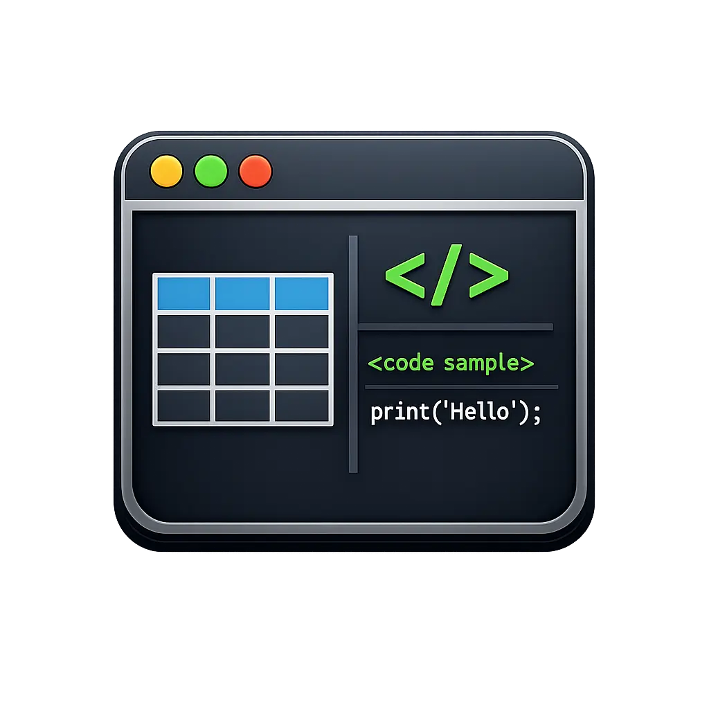

<div align="center">
  
</div>

# ratatui-markdown

> Una biblioteca Rust que ofrece renderizado de Markdown, diagramas Mermaid, resaltado de sintaxis, árboles JSON/TOML colapsables y widgets de desplazamiento enriquecidos para ratatui.
>
> **Construido con**: [ratatui](https://github.com/ratatui/ratatui) 0.30 + Rust puro
>
> **Versión mínima de Rust**: 1.88

<div align="center">
  <p>
    <a href="../../README.md">English</a> |
    <a href="../zhs/index.md">简体中文</a> |
    <a href="../zht/index.md">繁體中文</a> |
    <a href="../ja/index.md">日本語</a> |
    <a href="../ko/index.md">한국어</a> |
    <a href="../fr/index.md">Français</a> |
    <a href="../es/index.md">Español</a> |
    <a href="../ru/index.md">Русский</a> |
    <a href="../ar/index.md">العربية</a>
  </p>
</div>

## ¿Qué es ratatui-markdown?

ratatui-markdown es una biblioteca de renderizado rica en funciones para interfaces de usuario de terminal construidas con [ratatui](https://github.com/ratatui/ratatui). Proporciona múltiples módulos funcionales que pueden usarse de forma independiente o combinarse a través de los widgets `MarkdownPreview` / `MarkdownViewer`.

## Módulos Principales

### Renderizado de Markdown

Analiza y renderiza texto Markdown como salida de terminal con estilo:

- **Encabezados**: H1 (`#`), H2 (`##`), H3 (`###`)
- **Párrafos** con ajuste de línea automático compatible con CJK
- **Formato en línea**: `**negrita**`, `*cursiva*`, `***negrita+cursiva***`, `` `código en línea` ``
- **Bloques de código** con etiquetas de lenguaje opcionales (los bloques mermaid se renderizan como diagramas)
- **Citas** (`>`)
- **Listas no ordenadas** (`-`, `*`, `+`) y ordenadas (`1.`, `2.`)
- **Líneas horizontales** (`---`, `***`, `___`)
- **Tablas** con anchos de columna proporcionales y ajuste de celdas

### Vista de Árbol Colapsable

Analiza y navega interactivamente por datos estructurados:

- Analiza **JSON** y **TOML** en árboles colapsables
- **Expandir / Colapsar** nodos individuales, expandir todo, colapsar todo, expandir por profundidad
- **Claves estilizadas**: modo JSON (claves entre comillas + `:`) o modo TOML (claves simples + `=`)
- **Navegación por teclado**: selección y alternancia basadas en cursor
- **Color por tipo de valor**: cadenas, números, booleanos, null — cada uno con su color de tema

### Sistema de Desplazamiento Híbrido

Desplazamiento inteligente que maneja tanto la navegación libre como la navegación por elementos:

- **Modo de desplazamiento libre**: recorra el contenido libremente
- **Modo activado**: se activa automáticamente cuando elementos enfocables entran en la vista
- **Navegación por cursor**: muévase entre elementos enfocables con el teclado
- **Indicador de cursor**: prefijo visual `> ` en las líneas activadas
- **Barra de desplazamiento**: superposición basada en flechas
- **Paginación**: soporte de `page_up` / `page_down`

### Diagramas Mermaid

Renderizado directo de diagramas Mermaid en terminal:

- **Diagramas de secuencia**, **gráficos circulares**, **diagramas de Gantt**, **diagramas de estado**
- Activados por bloques ` ```mermaid `
- Bandera de funcionalidad: `mermaid`

### Resaltado de Sintaxis

Resaltado de bloques de código basado en tree-sitter:

- Banderas por lenguaje (`highlight-lang-rust`, `highlight-lang-python`, etc.)
- `highlight-lang-all` activa todos los lenguajes
- Personalizable via `HighlightHooks`

### Widgets MarkdownPreview / MarkdownViewer

El widget de alto nivel que integra todo:

- Renderiza contenido Markdown, vistas de árbol y elementos de acción en un solo diseño desplazable
- **Caché**: reconstruye la salida solo cuando cambia el contenido, el ancho o la generación del tema
- **Eliminación de preámbulo TOML**: elimina automáticamente el preámbulo TOML delimitado por `+++`
- **Elementos de acción**: elementos etiquetados seleccionables por teclado con IDs de acción
- Delega toda la navegación a `HybridScrollView`

## Inicio Rápido

```toml
[dependencies]
ratatui-markdown = "0.3"
```

### Ejemplos

| Ejemplo              | Descripción                          | Funcionalidades requeridas     |
|----------------------|--------------------------------------|-------------------------------|
| `basic`              | Renderizado Markdown mínimo          | —                             |
| `code`               | Bloques de código con resaltado      | `highlight-lang-all`          |
| `custom_code_block`  | Hooks de renderizado personalizados  | —                             |
| `image`              | Integración y zoom de imágenes       | `image`                       |
| `mermaid`            | Renderizado de diagramas Mermaid     | `mermaid`                     |
| `tree_list`          | Árbol JSON/TOML colapsable           | —                             |

```bash
cargo run --example basic
cargo run --example code --features highlight-lang-all
cargo run --example image
cargo run --example mermaid
cargo run --example tree_list
```

## Banderas de Funcionalidades

Todas las funcionalidades están habilitadas por defecto. Desactive las funcionalidades por defecto para habilitar solo lo necesario:

```toml
[dependencies]
ratatui-markdown = { version = "0.3", default-features = false, features = ["markdown"] }
```

| Funcionalidad        | Depende de                          | Descripción                                      | Por defecto |
|----------------------|-------------------------------------|--------------------------------------------------|-------------|
| `markdown`           | —                                   | Analizador y renderizador de Markdown            | ✓           |
| `image`              | —                                   | Resolución de imágenes via `ImageResolver`       | ✓           |
| `scroll`             | —                                   | HybridScrollView, listas desplazables, barra     | ✓           |
| `tree`               | `scroll`, `serde_json`, `toml`      | Árbol JSON/TOML colapsable                       | ✓           |
| `preview`            | `markdown`, `scroll`, `tree`        | Widget unificado MarkdownPreview                 | ✓           |
| `mermaid`            | `markdown`                          | Renderizado de diagramas Mermaid                 | ✓           |
| `viewer`             | `markdown`, `scroll`                | Widget MarkdownViewer                            | ✓           |
| `highlight`          | —                                   | Resaltado de sintaxis via tree-sitter            |             |
| `highlight-lang-*`   | `highlight`                         | Gramáticas individuales por lenguaje             |             |
| `highlight-lang-all` | `highlight`                         | Todas las gramáticas incluidas                   |             |

## Documentación

| Guía | Descripción |
|------|-------------|
| [Primeros Pasos](getting-started.md) | Instalación y primer renderizado |
| [Markdown](markdown.md) | Análisis y renderizado de Markdown |
| [Sistema de Desplazamiento](scroll.md) | Desplazamiento híbrido, navegación |
| [Vista de Árbol](tree.md) | Árboles JSON/TOML, expandir/colapsar |
| [Widget de Vista Previa](preview.md) | Combinar todo con MarkdownPreview |
| [Tema](theme.md) | Implementación de RichTextTheme |
| [Contribuir](contributing.md) | Guía de desarrollo y contribución |

## Licencia

Doble licencia MIT OR Apache-2.0.
